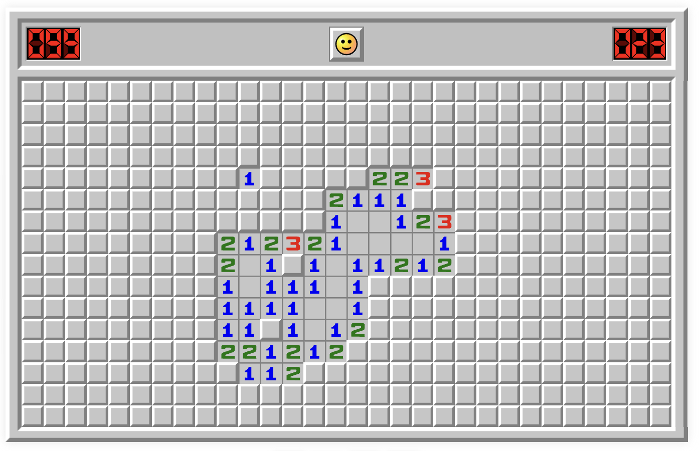

# Exercise 1: Problem Framing

## Personal Goals

After graduating from MIT this year, I will begin working as a quantitative developer. I see 6.1040 as an opportunity to prepare by filling two gaps in my academic and professional experience: working on original, personally meaningful designs and learning to use generative AI critically and effectively.

### Goal 1: Producing Original and Meaningful Designs

Throughout my professional and academic CS experience, most learning has taken place within predefined problems. Courses like 6.1910 and 6.1020 provided structured assignments, and my past software engineering internships gave me projects whose goals and broader impact had already been established. These experiences gave me the chance to learn new technical skills, but rarely required me to decide what should be built, or which features would make it valuable.

Taking 6.2050 last fall allowed me to design and implement an original FPGA project, which taught me that I learn most from hands-on experiences. Although the open-endedness made the work more challenging, it also made me more self-motivated. I expect 6.1040 to offer a similar challenge, particularly in anticipating how others will respond to my design decisions, but I plan to address this by researching potential users, emphasizing planning, and seeking staff feedback early. By the end of the course, I hope to be more comfortable with creating something meaningful out of my own design ideas, which would prepare me to take greater ownership of projects in my career.

### Goal 2: Using Generative AI

I have participated in two financial software engineering internships (in 2025 and 2026), and the role of AI changed noticeably between the two. Whereas my 2025 internship used LLMs occasionally for "generic" tasks like implementing well-known algorithms, my 2026 internship openly encouraged the use of AI for a variety of tasks, such as summarizing complex scripts and explaining financial concepts. Although I used these tools frequently, the internship's emphasis on speed and output left me little time to question and evaluate their effects on my learning.

6.1040 stood out to me because it uniquely encouraged the discussion of LLMs. Paired with a project-based structure, I feel this gives me the best chance to compare an LLM's knowledge with my own, and spot the specific places where it struggles. While working with AI tools, I plan to document and reflect on my usage, placing emphasis on how I verified its output. I am particularly excited to apply it to my Minesweeper-related project proposal below, as I trust my prior knowledge on the topic and community, so I am well-positioned to assess and question LLM implementation decisions here.

## Problem Statement

### Domain

Minesweeper is a single-player puzzle played on a grid of hidden cells, some of which contain mines. Clicking to reveal a "safe" cell—one that does not contain a mine—displays the number of mines among its up to eight adjacent cells, which allows the player to deduce which other cells are safe. To win, the player must reveal every safe cell without revealing a single mine, which ends the game immediately.

  
   
  <em>A partially solved Minesweeper board.</em>

Despite its single-player format, Minesweeper has a rich competitive online community. A major platform for the game is [minesweeper.online](https://minesweeper.online/), where players solve boards online and compare their performance through statistics. Common measurements include completion time, efficiency, and 3BV, which represents the minimum number of clicks needed to solve a particular board. These statistics allow community members to compare results and learn from stronger performances.

More recently, the game has expanded into real-time multiplayer play. Minesweeper.online offers a PvP mode in which participants race to complete separate copies of the same board side-by-side. This allows players to compete directly, but their actions remain independent and do not contribute to a shared solution. As a result, the multiplayer experience is less collaborative than the broader community, whose members regularly share strategies and learn from one another.

### Bad Situations

Existing multiplayer formats make other players’ progress visible without making their reasoning accessible. This creates several bad situations for players who want Minesweeper to function as a shared activity, rather than only as a competition:

1. **Limited group activity.** There are four friends who each like to play Minesweeper, and they want to solve a puzzle together on Minesweeper.online. Because the available PvP mode supports only two players per match, they must divide into pairs and play separate games. Even so, the matched players have little opportunity to discuss the puzzle because both players are focused on completing their own boards. The friends are divided across matches, and cannot participate in one genuinely shared activity.

2. **Getting stuck.** A player encounters a board position they do not know how to solve, and they ask for help from a more experienced friend. When they use a conventional single-player board, asking for help involves a considerable amount of friction: the player may need to send a screenshot or share their screen, and the friend still has no way to interact with the board directly to explain the solution and help the player move forward.

3. **Differences in skill.** Two friends of different Minesweeper experience levels want to play together, so they enter a PvP race. The experienced player recognizes patterns and completes their board quickly, while the newer player falls behind as they work independently. Repeated matches may therefore become predictable and discouraging rather than enjoyable, providing little opportunity to learn together.

### Corroboration

In researching existing multiplayer Minesweeper games and community discussions, I found evidence that some players want to move beyond the game’s traditionally solitary format. For example, Yermak[^1], a highly active and experienced player, proposes in his Minesweeper.online profile a cooperative mode in which two or more players solve the same board and share the reward. Although this represents only one player’s suggestion, I believe his extensive activity on the platform makes his perspective particularly informed, and provides direct evidence that at least one established community member wants a collaborative alternative to the current PvP mode.

Additionally, I found relevant discussion surrounding an independent live multiplayer Minesweeper game—MinesweeperPro—posted on Y Combinator's Hacker News[^2], which further suggested the desire for more collaborative features. User Paturages shared that the app's point system “steers the game towards competitiveness rather than cooperation,” which others echoed in their comments. Others described having few opportunities to contribute when faster players cleared the board first, and some requested private rooms for playing with friends. These experiences mirror my bad situations on differences in skill and limited group activity, leading me to believe that a shared board alone does not create genuine collaboration; players want to share a common goal, rather than compete for individual rewards.

Finally, I found a Steam statistics page[^3] for another independent game, Minesweeper Together, which supports both cooperative and versus play and suggests preference for a cooperative game mode. The page shows that 64.1% of players have earned the “Winning Together” achievement for winning a shared game, while 16.3% have earned the “On Top” achievement for winning a versus game. Although these percentages may not perfectly represent the broader Minesweeper community, the difference suggests that Minesweeper players may generally be more interested in collaborative multiplayer experiences than competitive ones.

My research has a couple limitations. For one, I did not find widespread complaints about Minesweeper.online’s current PvP mode, so I cannot conclude that the larger community is dissatisfied with it. 
Yermak’s proposal represents only one established player, while the Hacker News discussion and Minesweeper Together statistics concern two separate multiplayer implementations used by smaller subsets of the community. Altogether, the evidence does not fully establish broad demand for a collaborative Minesweeper game mode, but it does suggest that there is a smaller audience interested in solving boards together, and playing privately with friends.

### Workarounds and comparables

Players can currently use informal workarounds or alternative Minesweeper applications when they want to solve a board with others. These approaches make some form of shared play possible, but each introduces friction or leaves one of the bad situations unresolved.

#### Workarounds

**Screen sharing.** Players can open a conventional single-player board and share their screen while discussing each move over a call. This lets others offer help, but only the person sharing can interact with the board, forcing everyone else to communicate their moves indirectly.

**Playing in pairs.** Larger groups can divide into pairs and create multiple matches through Minesweeper.online’s PvP mode. Although everyone can play simultaneously, the group remains separated across competitive matches rather than participating in one shared activity.

Several existing applications also provide multiplayer Minesweeper directly, but each has drawbacks in their support for collaboration.

#### Comparables

**Minesweeper.online.** [Minesweeper.online](https://minesweeper.online/) serves the widest active community, providing a convenient browser-based game and completion statistics. However, its PvP mode gives two players separate boards and rewards them for completing their boards faster than one another. As discussed in the bad situations, this limits opportunities for players to collaborate and instead emphasizes direct competition.

**MinesweeperPro.** Presented in Hacker News, [MinesweeperPro](https://minesweeperpro.com/) places up to three automatically matched players on one shared board. However, it incorporates an individual-based point system and gives the winner a doubled reward, making personal performance more important than the group’s shared completion. It also does not display board statistics, and its visual design differs from what is familiar to the established competitive community; this may make it less appealing to experienced players who want to use a familiar platform.

**Minesweeper Together.** [Minesweeper Together](https://store.steampowered.com/app/3550060/Minesweeper_Together/) offers the most collaborative approach: up to eight players can solve one board cooperatively, while drawing on it to communicate. However, the game must be obtained through Steam and installed on a Windows computer, creating barriers for friends who use another operating system or do not want to purchase and download a separate application. As an independent platform, it also doesn't connect to the established profiles and familiar performance statistics found on Minesweeper.online.

### Solution sketch

I propose a browser-based multiplayer Minesweeper application in which a small group can solve one board together in real time. The application would preserve the familiar rules, appearance, and performance measurements of traditional Minesweeper while emphasizing collective effort over competition. The following features will support these goals:

- **Synchronized board.** Every player will interact with the same board, with reveals and flags appearing immediately for everyone. Any participant could therefore contribute directly or demonstrate a move when another player gets stuck.
- **Private game rooms.** A player could create a room, and invite several friends by sharing a room code. This would allow a larger group to join one activity without splitting up or relying on global matchmaking.
- **Familiar statistics.** After each game, the application would display standard measurements such as completion time, 3BV, and efficiency for the group’s completed board. These statistics would preserve the performance feedback experienced players value, allowing them to evaluate the group’s result without ranking individual contributions.
- **Collective outcome.** The group would win by revealing every safe cell, and lose if any participant reveals a mine. The application would not assign individual points, encouraging players to discuss uncertain moves and help one another reach a shared goal.

[^1]: [Yermak’s player profile, Minesweeper.online](https://minesweeper.online/player/15420315)

[^2]: [“Show HN: I made a live multiplayer Minesweeper game,” Hacker News](https://news.ycombinator.com/item?id=43398081)

[^3]: [Minesweeper Together global achievement statistics, Steam Community](https://steamcommunity.com/stats/3550060/achievements)