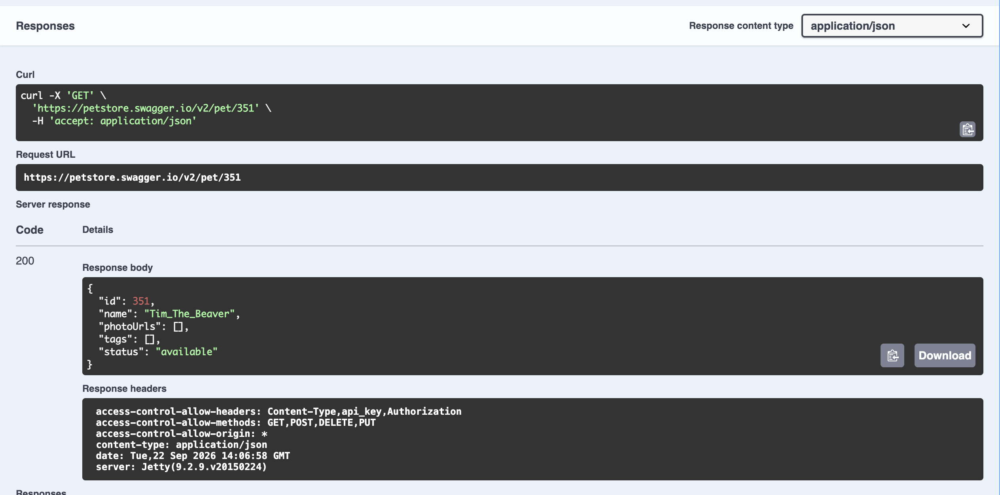

# Prep 3 Exercises

### a. In Task 1, what was the exact value of the content-type response header?

The exact value was `application/json`.

### b. In Task 2, under what key in the returned JSON body did your `{"task": "prep", "completed": true}` appear?

This json body appeared under the key `json` in the response.

### c. Run `curl -i "https://httpbin.org/status/418"` in your terminal. What ascii art is returned? 

```

    -=[ teapot ]=-

       _...._
     .'  _ _ `.
    | ."` ^ `". _,
    \_;`"---"`|//
      |       ;/
      \_     _/
        `"""`
```

### d. In Task 4, why did the server return a 404, whereas in Task 6 the exact same request yielded a 200?

Task 4 yielded a 404 because we were trying to fetch a pet object that was never created on the server side. After making a PUT request in task 5, the pet was stored in the backend, so we were able to successfully retrieve it in task 6.

### e. Attach a screenshot of your JSON response from Task 6

<p align="center">
  
</p>