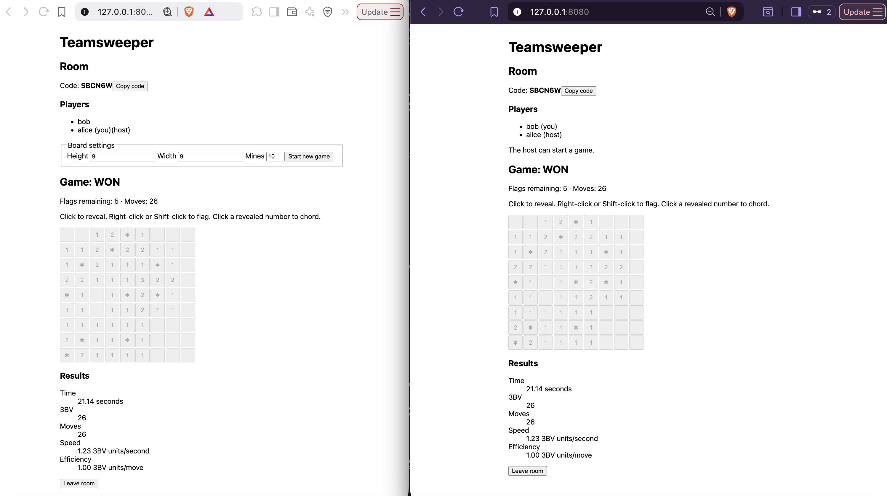

# Personal Project: Design Notebook

Welcome to my design notebook! Below are my realizations and design changes, listed per-assignment and in the order I considered and resolved them.

## P1: Design

**Breakpoint 1: Adding annotation.** After further considering the existing multiplayer Minesweeper apps, I decided that some "Annotating" functionality would be quite helpful and allow for easier collaboration, in support of my goal to make the game more cooperative. [Minesweeper Together](https://store.steampowered.com/app/3550060/Minesweeper_Together/) was a comparable app I considered in Exercise 1, and it allows users to draw on the board to communicate/solve together when they are stuck. I am a fan of the easy-to-use annotations offered on [Chess.com](https://www.chess.com/) which allow you to highlight squares and draw paths, so I think incorporating a similar highlighting feature would be a good choice. In terms of concept design, I also think this is separate from game functionality, rooming, etc. as I introducted in my Exercise, so it could be organized into its own general concept `Annotating [User, Item]`. I still need to decide how the user would place down annotations, since both left-click and right-click already have standard functionality for game-playing.

**Breakpoint 2: Splitting into concepts.** After deciding key features, I got a bit stuck on trying to split functionalities into individual modular concepts. 

I decided `RoomJoining [User, Game]` could definitely be its own concept, as the functionality for creating, joining, and closing a room was orthogonal to playing a game, and creating/starting the game can be triggered via reactions.

Then, I considered how to encode gameplay into concepts. I decided one large `MinesweeperPlaying` concept was the best way to group game creation, cell reveals, cell flags, game state, and time/statistics; this is because all such actions will depend on one shared board state, and splitting into different concepts would create complex dependencies. I was partially considering against this design decision because it would require one lengthy concept, but since the Minesweeper game/moves are largely self-contained and not subject to change, it would make sense to encode them together in this way.

Beyond gameplay functionality, storing/ranking statistics is a separate functionality I want to incorporate, since it is a useful performance indicator on [Minesweeper.online](https://minesweeper.online/). Storing and ranking games requires no specific structure on the game or its associated fields, so I think `PerformanceRanking [Item, Metric]` would be sufficient, i.e. each Item is tied to a list of Metrics it can be filtered/ranked by.

Lastly, I considered incorporating Annotation as a concept, and I wanted to stick with my initial generic `Annotating [User, Item]` idea which can associate an item to an annotation made by a user, or remove/manage such annotations. 

**Breakpoint 3: Type parameters revision.** I decided `PerformanceRanking [Item, Metric]` wasn't generic enough for the purpose of ranking, because I also want players to be able to filter by room, board type, and possibly any other additional properties. So, I am expanding to `PerformanceRanking [Item, Scope, Category, Metric]`, where `Scope` will be a coarse filter applied (ex. filtering by room), which can be subdivided by `Category` (ex. board size). Each `Metric` will still maintain its same functionality, where we can view/rank by its value.

I also decided `RoomJoining [User, Game]` only needs to be `RoomJoining [Game]`, because part of my goal is to make games easily shareable without a player needing to have an established user identity. Instead, Rooms will just have sets of Participants each with their own display name.

**Breakpoint 4: 3BV in Minesweeper state.** I decided against including board-derived metrics like 3BV in the `MinesweeperPlaying` state, because although they are properties of the board, they are not essential to the "playing" functionality and instead pertain more to `PerformanceRanking`. I chose to expose a `_getResult` query action which can compute and return all performance metrics based on the stored state of the game, which a reaction can retrieve all at once and feed into `PerformanceRanking`. I think this cleanly isolates the functionality of generating statistics from the functionality of playing.

**Breakpoint 5: Create vs. reveal actions.** I was debating where exactly the action of "starting" a game should go, because there are a couple steps required to begin playing. I was first considering making the `create` action place mines and start the timer, and subsequent `reveal`s proceed on a created board. But, typically Minesweeper boards place mines on cells distinct from your first click location (to ensure you don't instantly lose), and the timer starts at your first click. Instead, I made the `reveal` action also place mines and start the timer on the first click, and the `create` action just initializes the Game object. This also creates a good separation for the lobby + game UI's, since `create` can move players to the game screen, and the game will only actually start at the first `reveal`.

**Breakpoint 6: Room closing and hosting.** While thinking through my `RoomJoining` concept, I was considering how whole-group actions like starting the game should occur, which I figured would be handled by a host (person who creates the room). But it is also possible for the host to leave, so I chose to add arbitrary host reassignment for when this happens. I'm not sure whether this is the best option right now (perhaps a new player doesn't want to host), but I think it would be easy to modify within the `RoomJoining` concept if I want to change this logic later. I also decided that a room would close automatically when everyone leaves, which makes sense as there is no longer a host or any active participants.

**Breakpoint 7: UI design choices.** When working on the UI sketches, I was unsure where exactly to place each game-related functionality, since I also needed to incorporate annotation, and actions for game restart. I think a UI that has as few additional/unfamiliar buttons as possible is preferred, so I chose to integrate both of these just into the Minesweeper board itself. A center-click would add annotations, and the host would be able to click the top bar of the board to start a new game (also a function in popular Minesweeper sites). I was alternatively considering having a "toggle annotation mode" button at the side of the board, but I think this would be inconvenient for players who just want to quickly reference a part of the board.

## P2: MVP

### Initial Implementation Plan

My overall plan for implementation has the following steps:
1. Write the design for MVP concepts (`MinesweeperPlaying`, `RoomJoining`, `Annotating`). I will follow the sync-engine tutorial to draft the markdown for these concepts, their types, and their compositions, heavily basing the documentation on my P1 work (I'll include all actions from there initially), and check the design as I write. These will give me sufficiently detailed specifications to implement, test, and iterate on.
2. Implement `RoomJoining`. I will start with the backend TypeScript and MongoDB operations (updating the design markdown accordingly as I iterate), and I will test the actions/API I write before moving onto the frontend. From there, I will create a very basic lobby UI using Vue (unstyled inputs/buttons to create/copy/join rooms).
3. Implement `MinesweeperPlaying`. I will similarly start by implementing the backend logic, which includes all legal game moves, and determining win/loss (I'll hold off implementing `_getResult` til later, when I focus on storing statistics). I'll connect room operations to game creation by registering new sync-engine compositions, and test the actions, API functions, and integration. Then I'll draft the frontend, which will have a `Board.vue` child to render the board and accept user input requests. I'll first test the game in full as a single player, then I'll open two sessions to test the synchronized play and automatic state update for multiplayer.
4. Implement `Annotating`. I'll implement the backend of `Annotating`, test its functionality, and rebuild its requests through sync-engine. I'll then add the frontend component of rendering highlighted cells selected by each player. I'll test this out in a multiplayer gamemode by similarly opening two sessions.
5. Implement `PerformanceRanking`. I'll first complete and re-register `MinesweeperPlaying` with the query `_getResult`, then complete and connect the `PerformanceRanking` backend to store results. After testing the statistics and ranking on various games, I'll implement the skeleton UI I initially drafted, which sorts and shows results in the game sidebar.
6. Finalize frontend. One goal of my app was to maintain a familiar Minesweeper UI, which I will leave as a last step once I've verified all functionality. Here, I'll restyle and reorganize the UI to be as simple and user-friendly as possible, and iterate on any data display choices.

My target for P2 is to get as far as step 4, and start on step 5 by implementing end-of-game statistics. I will continue with this plan if I have time remaining, and leave the remaining work for P3.

**Breakpoint 1: context + step 1 revision.** As an added "step 0" to my plan above, I went through sync-engine documentation to understand what was expected in my design markdown docs, as it was slightly different to what I initially wrote in P1. For example, I spotted that type parameters needed to be declared differently, in a "types" section and as external types. I additionally saw the examples had `refuses` error codes, so I translated my action preconditions into more precise cases like the `Reserving` example. I also made state-reading queries implicit in my P1 (i.e. ones that were just pulling some state field), but here I wrote explicit definitions for getters so that reactions would be able to access these parts of state. With the help of an LLM to parse documentation, I saw that sync-engine specified `Rule:` lines for invariants (helpful documentation for implementation), which I drafted as well as I believe it would strengthen my design and catch bugs while I test.

Since my work just for the `RoomJoining` concept was quite extensive, I decided to focus on getting the full backend pipeline working for just this one concept before moving onto the others, which would also require markdown redrafting. I think it is easier for me to extend an existing backend framework rather than build entirely new components one-at-a-time, so starting with only one concept specification that is implemented and tested would make it easier to draw inspiration from existing code/documentation, and extend to the other concepts later.

**Breakpoint 2: `RoomJoining` TS implementation discoveries.** While implementing, I noticed that there was a hole for race conditions in my initial plan of host assignment/room leaving, because if actions could interleave, then it would be possible for (1) Host A to begin a `leave` action and select Participant B as the next future host, (2) Participant B to leave, then (3) the `leave` action assign B to be the new host. But returning to the sync-engine documentation, I saw that actions were serialized per concept instance, so I wouldn't have to worry about this.

I used an LLM to draft my TypeScript implementation and I manually verified logic function-by-function. Overall I found the markdown files to be incredibly helpful in drafting and verification because the structure of my TS file was ultimately very similar to the markdown.

There were a couple helper methods I needed to implement which were not initially in my concept design plan, which are `#makeCode` and `#ensureIndexes`. For simplicity in P1 I skipped the details of "generating a random unique code", which I now needed to implement an algorithm for. I decided a 6-character code, each character from a 32-letter alphabet, would be a strong choice as it would offer ~10^9 total possibilities i.e. low probability of collision. I believe a 6-letter code is also used by 6.1040's class join page, and I think it is a readable and user-friendly approach to code generation. Additionally, I followed the sync-engine tutorial's example of enforcing uniqueness invariants (as was done in `reserve`), as I needed a similar property to enforce that codes and assigned games were never duplicated, hence I added the `#ensureIndexes` setup helper.

When testing, I found it helpful to reuse aspects from the mongo-practice tutorial. I decided to organize tests into a separate directory, reuse test-db logic, and structure my asserts similar to the example ones there. The `test-api` script from the prep assignment was also helpful, and I am planning to write similar assertion-based scripts to test the API/integration later down the line. I found it helpful to draft a list of concrete cases/features I wanted to test behavior for, namely one standard round of entering/exiting a room, host reassignment, inactivity handling, and bad request handling. I planned 9 tests for my concept code and found it helpful to have an LLM draft the implementation for them.

**Breakpoint 3: Sessioning addition.** While expanding my `RoomJoining` implementation, I realized that I abstracted away the mechanism which is assigning a user to a participant ID for the duration of their play. I was considering integrating this concept into `RoomJoining` since we could potentially store a session ID or another trustworthy identifier within this concept's state, but I think this solution is not so modular as we may potentially want other auth mechanisms in the future. So, I decided to add a `Sessioning` concept which was entirely independent of room membership, and would allow endpoints to identify the requester. This required adding one new simple concept to my documentation, which I then implemented in the same order of steps as I did for `RoomJoining`. When implementing, I decided to keep cookie handling in `http.ts` rather than in `Sessioning`, because session identity was independent of how the token was transported. In my integration testing, I included the `Set-Cookie` and transport steps to make sure the full combined behavior was as intended.

At this point I had two drafted concepts, so I first chose to test the Sessioning concept code via three checks (the concept itself was quite simple). Then, I chose to draft integration tests, where I included both session and cookie handling as part of how room membership was handled. I thought it would be most important to check that issued sessions identified the right participants, and that expired sessions could not authorize requests.

**Breakpoint 4: Frontend setup.** I followed the sync-engine tutorial for setting up the frontend, but since I want my app to use Vue, I needed to adapt the instructions to use Vue + Vite as was recommended. I created a similar `web/` subdir, and with LLM help I drafted a basic `App.vue` and `main.ts`, and I set the `PUBLIC_ORIGIN` environment variable according to my configured frontend. I had some trouble running `bun run check` with the new `web/` directory (it seemed like `tsc` wasn't recognizing the .vue and CSS imports), and I asked the LLM for help to resolve this. It explained that tsc does not understand .vue and CSS imports by default, so I added declarations in `env.d.ts` to let it recognize them. In the end, I could run the page via `bun run dev`, and I could manually verify that everything was working (page rendering + Vue interactions) by navigating to the frontend URL.

**Breakpoint 5: Frontend functionality testing.** The first part of the frontend that I implemented was the `RoomJoining`/`Sessioning` UI, where I added basic controls for creating/joining/leaving rooms, along with copying the room code and displaying request errors. I also needed to adapt the tutorial's `app.ts` example into Vue, which my LLM helped me with. I also chose to skip styling, so as to focus on functionality first.

I tested the lobby UI manually through `bun run dev` and navigating to the frontend URL. I tested creating/leaving lobbies (checking that reloading restored my session and the UI required me to leave before joining another lobby), and tested joining via code (specifically that you could join an existing/active lobby, not inactive ones, and not nonexisting ones). I also tested opening multiple sessions via private windows, so I could check that a user could join someone else's lobby. All my tests were successful, and gave the expected behavior.

**Breakpoint 6: Extending frontend data display, polling, and views.** In my basic frontend with lobby UI functionality, there was little to no data actually displayed in the lobby, whereas my initial plan was to include a list of the joined players. I decided to implement this with a 2-second polling mechanism because I wanted updates to occur without refresh (and I could change the frequency of polling later). This polling only occurs when the user is in a lobby (polling takes place on a particular Vue component).

I also realized I had incomplete understanding of the term `view`, where I wasn't yet defining views in my documentation/backend. I learned that the `view` could define a larger backend lookup, so I defined one for `ActiveLobby` properties which could be reused in the endpoints.

With the extended view, I added new integration tests to check the lobby response after various joins/leaves. Through testing, I spotted and corrected some errors in my LLM's draft of a `Rooms.ts` endpoint (there was one missing response step), and I corrected it.

**Breakpoint 7: MinesweeperPlaying implementation + error codes.** While rewriting the documentation for the `MinesweeperPlaying` concept, I realized that there could be a lot of different error cases that would be split across individual actions (ex. "MOVE_NOT_ALLOWED" within a chord move, flag move, reveal, ...), and I wanted to be able to group the error codes for a simpler design. I reviewed the sync-engine documentation and saw that error codes could be shared across actions, so I rewrote my `refuses` lines to account for this. Rather than having ~15 separate error codes, I was able to reduce to three main ones. With LLM assistance, I thoroughly tested each of these broader error cases after implementing the concept functions.

I will also return to my `Sessioning` and `RoomJoining` concepts to see if I can better group error cases like this, in case it might clean up my design/implementation.

**Breakpoint 8: Plan revision.** I initially said that I would implement `_getResult` as a later part alongside `PerformanceRanking`, but I decided that implementing and displaying the results now would be easier because I was already working on the Minesweeper concept function implementations. Since the Minesweeper moves/actions were at the top of my mind, it would be easier to complete now, then just focus on wiring this data and ranking the results when I implement `PerformanceRanking`.

**Breakpoint 9: Integrating MinesweeperPlaying.** Integrating the new concept was a somewhat new experience as I needed to consider what features were already in place and how I would organize testing the new reactions. I decided that organizing my integration test files incrementally made sense, as I already knew that the `Rooms` integration tests were passing, so I could organize all my `Game`-related tests in a new file to check the added Game integration functions. After drafting those and getting them to pass, I was confident the backend was functioning as intended, so I could move onto implementing/manually verifying the Minesweeper UI. My tests checked host-only game creation, shared moves across different participants, rejection of unauthorized requests, and win/loss statistics.

**Breakpoint 10: UI Testing.** At this point in testing the UI, I realized it would be helpful to list details on the page that I wouldn't necessarily display in the final product. While drafting the Game UI, I found it helpful to list the raw game status on the page, so I could ensure that the display made sense given the status. I tested the game by opening two sessions (one host, one additional participant) and checking that synchronized moves would register/update on both screens, and the host had additional settings/restart controls. I tested for win, loss, restart, and mid-game leave/joins, and refreshed the pages at various points to check that the lobby state was being restored/rendered. Below is a screenshot from my (unstyled) successful UI testing!

  

**Breakpoint 11: UI refactoring.** My `App.vue` code was getting a bit lengthy at this point, so I decided it would be a good idea to do a minor refactor/restyle just to get the overall visual structure I initially planned. My P1 UI sketches included a "sidebar" mainly for information, and a main panel for actions. The main components I could identify right now were the sidebar, lobby view, gameplay view, settings panel, and the game board itself, so I decided to group vue code according to this (`components/Sidebar.vue`, etc.). As I continue to build UI features, I think this will make it easier to identify the added features and reason where their rendering should belong. After this refactor, I checked for the same behavior as I tested when building my UI in the last breakpoint. 

**Breakpoint 12: Integration test refactoring.** I noticed one poor design choice of my existing integration testing, which was that I called `assemble` separately within each file; this would require me to update every single instance map every time I made an addition. As a small refactor, I thought it would be better to create a separate `test-app.ts` file similar to `test-db.ts`, and this would allow me to resuse both the app assembly and api instantiation logic which would be shared across all future integration tests. After my refactor, I reran tests to make sure all were still passing.

**Breakpoint 13: Composite type in `Annotating`.** When writing P1, I specified that the the `Annotating` `Item` generic type would be instantiated to `(MinesweeperPlaying.Game, MinesweeperPlaying.Coordinate)`, which was sort of informal. When implementing this with sync-engine, I thought to create a concrete type `GameCell` which would aggregate this info in order to instantiate the `Annotating` concept. I first thought to encode a list/tuple as a string and pass that as the Item type, but I thought this approach wasn't very ready-for-change, so instead (after reviewing documentation with LLM help) switched to an object-like type which sync-engine would support. I slightly modified by initial concept design by adding the `GameCell` type into `types.md`, and tested this when implementing/integrated annotating.

**Breakpoint 14: Plan deviation with annotation UI.** While implementing the annotation UI, I had many ideas for how I would actually render cell highlights, and I decided to spend more time on this UI-specific detail right now rather than saving it for later. I wanted a couple key features for highlighting, which were that (1) each player had their own highlight "color" (stateless, i.e. only deterministically derived from the lobby state), (2) colors assigned to different players were visually different up to some number of players, and (3) colors would be somewhat different for each lobby you joined (to make things interesting). To implement this, I added `colors.ts` which would control color-related selection and operations: colors are picked from a constant RGB palette, randomly but seeded based on the room ID, and assigned in participant ID order. This would ensure colors were consistent across reloads and across different user views. Since multiple users could highlight one cell at the same time, I used CSS `color-mix()` in order to combine the corresponding colors in a visually pleasing way, but still maintain the alpha value so you could see the contents of the cell. I stuck with my initial plan of making center-click create highlights, where a user can either click or drag. One tradeoff of this being stateless is that colors may reshuffle when players join or leave, but I think I am ok with this feature as trying to maintain consistent colors across joins/leaves may also be messy. I tested the highlight, unhighlight, clear, mixing, and color assigning functionalities manually by opening various sessions and lobbies.